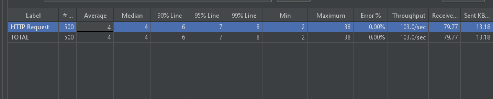

## 东北特产电商系统接口压力测试

### 项目背景
本项目模拟一个东北特产电商系统的后端服务，使用 Python Flask 框架搭建 RESTful API，提供商品列表查询接口。在此基础上，使用 JMeter 对该接口进行压力测试，验证系统在高并发场景下的性能表现。

### 技术栈
- 后端框架：Python / Flask
- 压力测试工具：Apache JMeter 5.6.3
- 接口类型：RESTful API (GET)
- 数据格式：JSON

### 项目结构
dongbei-ecommerce-api-test/
├── app.py                 # Flask 后端代码，含商品数据与 API 接口
├── dongbei-api-test.jmx   # JMeter 测试脚本（50并发，500次请求）
├── 聚合报告.png            # 压力测试结果截图
└── README.md               # 项目说明文档

### 如何运行

#### 1. 启动 Flask API
pip install flask flask-cors
python app.py
浏览器访问 http://127.0.0.1:5000/api/products 确认返回 JSON 数据。

#### 2. 运行 JMeter 压力测试
- 打开 JMeter，加载 dongbei-api-test.jmx
- 点击绿色三角按钮运行测试
- 查看 Aggregate Report 获取性能数据

### 运行结果
- 并发用户数：50
- 总请求次数：500
- 平均响应时间：4 ms
- 吞吐量：103 req/s
- 错误率：0.00%

